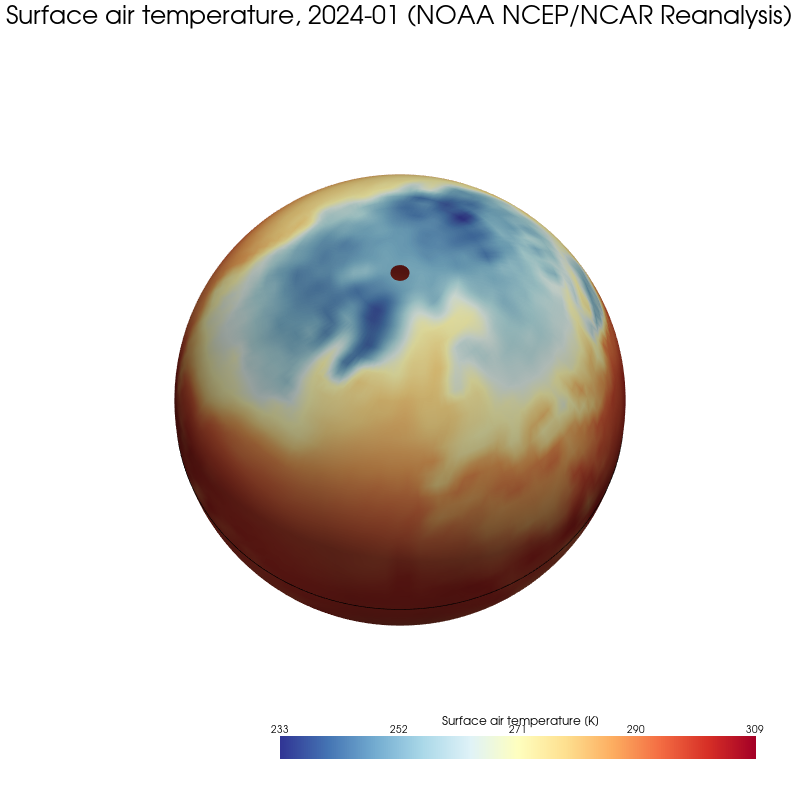
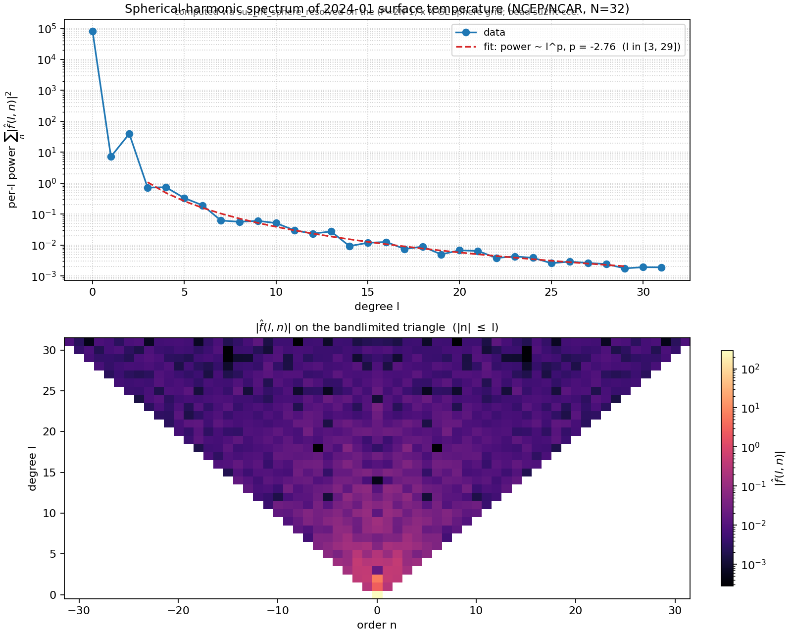

# SU(2) Fast Fourier Transform

A C implementation of the O(N⁴) Fast Fourier Transform on SU(2), following
the algorithm of Delgado et al., *On The Fast Fourier Transform on SU(2)*,
[arXiv 2605.23923](https://arxiv.org/abs/2605.23923) (May 2026), with
arbitrary-precision certification, a spherical-harmonic specialisation, a
spectral convolution, and Python and Julia bindings.

---

## Why this exists

### The classical miracle

In 1965 James Cooley and John Tukey published an algorithm that changed
computation permanently. The observation is deceptively simple: a Discrete
Fourier Transform on N points shares sub-expressions across frequencies in a
way that lets you recurse, halving the problem at each level. The consequence
is not a mild improvement. To compute the DFT of N = 2³⁰ samples directly
costs O(N²) operations; at one nanosecond per operation that is roughly
13,343 days. The Cooley-Tukey FFT reduces the count to O(N log N), bringing
the same computation down to 64 seconds — a speedup of nearly seven orders
of magnitude.

That is what it means to find the right structure in a computation. The FFT
does not approximate anything; it computes the exact same sum, just in a
different order. Convolution becomes pointwise multiplication in the
frequency domain. Differential equations on periodic domains become algebraic
systems. Signal filtering, audio compression, MRI reconstruction,
gravitational wave detection — all of it rests on one recursive decomposition
discovered in the Cold War to identify covert nuclear tests.

### When the domain curves

The classical FFT lives on flat space: functions on Rⁿ, or on the torus Tⁿ.
When the domain is a curved manifold — a sphere, a rotation group, the space
of quantum states — the notion of "frequency" does not disappear, but it
changes character. The Peter-Weyl theorem tells us that L² of a compact Lie
group decomposes into irreducible unitary representations indexed by a
discrete label l. The basis functions are no longer scalars eⁱᵏˣ but
(2l+1) × (2l+1) matrix-valued objects: the matrix coefficients tˡₘₙ.
Harmonic analysis on these spaces is both richer and harder than the flat
case.

SU(2) — the group of 2×2 unitary matrices with determinant 1 — is the
simplest non-abelian compact Lie group. It is the double cover of SO(3), the
rotation group of physical 3-space. It is diffeomorphic to the 3-sphere. It
is the spin group underlying half-integer angular momenta in quantum
mechanics. And it is the natural domain for a class of algorithms in quantum
computing that has attracted intense recent interest.

### The quantum signal processing connection

Quantum Signal Processing (QSP) encodes a polynomial transformation of a
unitary operator as a product of SU(2) rotations parameterised by a sequence
of phase angles. Computing or inverting a QSP sequence requires understanding
the spectrum of that product — which is precisely a question about the
Fourier analysis of a function on SU(2). As Delgado et al. observe, *QSP
sequences for su(2) and su(1,1) are intimately related to the nonlinear
Fourier transform.* A fast SU(2) FT is therefore a building block for fast
QSP simulation and inversion, two operations central to the compilation of
quantum algorithms.

The O(N⁶) direct transform is already computed in the literature. What has
been missing — until this paper — is the FFT analogue: an algorithm that
exploits the structure of the matrix coefficients to reduce the operation
count, the same way Cooley-Tukey exploits the structure of eⁱᵏˣ.

### What this repository does

A working C implementation of the Delgado et al. O(N⁴) algorithm, built
test-first and cross-validated end-to-end. Four parallel paths
(direct/fast × double/arbitrary-precision) agree to floating-point noise on
every input the test suite throws at them. The arbitrary-precision path,
built on FLINT's ball arithmetic, delivers certified spectrum roundtrip at
any working precision the caller chooses — 4.4 × 10⁻⁷² at 256 bits, scaling
as 2⁻ᵖʳᵉᶜ.

---

## A look at it running

January 2024 surface air temperature from the NOAA NCEP/NCAR Reanalysis,
fetched, interpolated onto the SU(2) sample grid, and visualised on the
3-sphere:



The Siberian winter cold pole sits at the top; the equatorial belt warms in
red across central Africa; the entire Southern Hemisphere shows its January
summer. The same field, transformed to its spherical-harmonic spectrum:



The per-degree power follows a clean `l⁻²·⁷⁶` decay across three decades,
within the band documented in the climate-spectra literature for smooth
geophysical scalars. The lower panel shows the magnitude of each
coefficient on the bandlimited (l, n) triangle.

Interactive 3D versions (drag/rotate in a browser):

- [examples/figures/weather_pyvista.html](examples/figures/weather_pyvista.html)
- [examples/figures/weather_plotly.html](examples/figures/weather_plotly.html)

Reproduce end-to-end in about seven seconds on a laptop:

```sh
make lib                                          # build libsu2.so
python3 -m venv .venv
.venv/bin/pip install -r examples/requirements.txt
.venv/bin/python examples/weather_demo.py
```

---

## Features

**Two flavours of forward and inverse FFT.**

- A **direct O(N⁶) transform**, the literal triple sum from the paper. Used
  as ground truth for every cross-check. Two implementations: one in plain
  double, one in FLINT arbitrary-precision arithmetic with certified error
  balls.
- A **fast O(N⁴) transform** that exploits the factorisation of the matrix
  coefficient `tˡₙₘ(φ, θ, ψ) = Pˡₙₘ(cos θ) · exp(-i(nφ + mψ))`. A single 2-D
  FFT per latitude slice handles the (φ, ψ) integration in O(N³ log N); a
  Wigner-d recurrence sweeps the latitude inner product in O(N⁴). Two
  implementations again: double-precision via FFTW, and arbitrary-precision
  via FLINT.

**Two sampling conventions.** The paper specifies one grid; we additionally
support the convention shared with the broader spherical-FFT community
(s2fft, SHTns, SOFT) — a 2N-1 open uniform grid in φ and ψ paired with N
Gauss-Legendre nodes in θ. This *resolved* grid achieves exact spectrum
roundtrip at working precision: `forward(inverse(fhat)) = fhat` to machine
epsilon in double, and to 2⁻ᵖʳᵉᶜ in arb. The paper's original grid is
retained for direct comparison against the reference.

**Spherical harmonic transform on S².** A thin wrapper restricts to
ψ-independent functions: spectrum lives entirely on the m=0 row of each
degree-l block. Storage drops from N³ samples + N(2N-1)(2N+1)/3 coefficients
to (2N-1)·N samples + N² coefficients. Same exact roundtrip.

**Spectral convolution.** Peter-Weyl convolution theorem on a compact group:
a convolution in sample space is a per-degree matrix product in spectrum
space. `su2_convolve(N, fhat, ghat, fghat)` runs this in O(N⁴). Suitable for
smoothing on SO(3), template matching on rotated 3-D images, or
group-averaged neural-network layers.

**Half-integer Wigner-d evaluation.** Spin-1/2 representations need
half-integer l. `su2_wigner_d_half(2l, 2n, 2m, θ)` evaluates the matrix
coefficient at half-integer arguments, with the argument convention chosen
to avoid floating-point comparisons.

**Python bindings.** A minimal ctypes wrapper, `python/su2fft.py`, exposes
the sphere FFT to NumPy. The weather demo above shows it driving an
end-to-end pipeline from NetCDF data through to interactive 3-D rendering.

**Julia bindings.** A full package at `julia/`, drivable via `Pkg.develop`
and `Pkg.test`. Layout chosen so a row-major C array maps to a Julia 3-D
`Array{ComplexF64,3}` with no permutation.

**Certified precision.** Every routine in the arbitrary-precision path
returns FLINT `acb_t` ball intervals carrying provably-correct bounds. At
512 bits of working precision the worst-case ball radius on every output
coefficient is 9.6 × 10⁻¹⁵⁴ — 154 verified decimal digits.

---

## Quick start

```sh
# Build the C library + tests + benchmarks
make

# Run the full cross-validated test suite (~3 seconds, 70 tests)
make test

# Cross-comparison benchmark (direct vs fast, timing + max-diff at each N)
make bench

# The weather demo (Python venv with NumPy, SciPy, matplotlib, pyvista, plotly, ...)
python3 -m venv .venv
.venv/bin/pip install -r examples/requirements.txt
.venv/bin/python examples/weather_demo.py
```

Dependencies: a C11 compiler, `libfftw3-dev`, `libflint-dev` (FLINT ≥ 3.0).
Tested on Debian/Ubuntu Linux.

---

## A short tour

### From C

```c
#include "su2.h"

int N = 8;                                    /* bandlimit */
int P = 2*N - 1;                              /* resolved-grid phi/psi axis */
size_t nsamp = su2_resolved_total_samples(N); /* = P*P*N */
size_t ncoef = su2_total_coeffs(N);           /* = N(2N-1)(2N+1)/3 */

double _Complex *f    = malloc(nsamp * sizeof(double _Complex));
double _Complex *fhat = malloc(ncoef * sizeof(double _Complex));

/* Sample f on the open phi/psi + GL-theta grid, then transform: */
su2_fft_resolved    (N, f,    fhat);   /* forward */
su2_fft_resolved_inv(N, fhat, f   );   /* exact inverse */

/* Or stay in spectrum space and convolve two functions: */
su2_convolve(N, fhat_f, fhat_g, fhat_fg);
```

### From Python

```python
from python import su2fft
import numpy as np

N = 16
P = su2fft.P(N)                                 # = 31
f = np.zeros((P, N), dtype=np.complex128)
f[:] = 1.0                                       # constant function

fhat = su2fft.fft_sphere_resolved(f)             # shape (N**2,) complex
f2   = su2fft.fft_sphere_resolved_inv(fhat, N)   # back to (P, N)
```

### From Julia

```julia
using SU2FFT
N = 8
f = randn(ComplexF64, N, N, N)

fhat_fast   = SU2FFT.fft(f)         # O(N^4)
fhat_direct = SU2FFT.ft_direct(f)   # O(N^6), reference
@assert maximum(abs, fhat_fast .- fhat_direct) < 1e-10

f_back = SU2FFT.fft_inv(fhat_fast, N)
```

The Julia package also exposes the spherical-harmonic FFT, the spectral
convolution, and the half-integer Wigner-d evaluator.

---

## What is measured

### Speed: fast vs direct

```
   N |  direct (s) |    fast (s) |  speedup |   max |diff|
-----+-------------+-------------+----------+-------------
   4 |    0.000142 |    0.001105 |     0.13 |     5.9e-17
   6 |    0.000961 |    0.000375 |     2.56 |     4.6e-17
   8 |    0.004721 |    0.000955 |     4.94 |     5.3e-17
  10 |    0.013280 |    0.001279 |    10.39 |     1.3e-16
  12 |    0.040555 |    0.001990 |    20.38 |     6.6e-16
  14 |    0.087188 |    0.003556 |    24.52 |     7.1e-16
  16 |    0.177889 |    0.004820 |    36.90 |     1.6e-15
  20 |    0.655026 |    0.009028 |    72.55 |     2.1e-14
  24 |    1.832225 |    0.020154 |    90.91 |     2.2e-13
```

The maximum coefficient-wise disagreement stays within floating-point noise
across the full range: the two algorithms compute the same discrete sum. At
N=24 the fast path runs roughly 90× faster from a cold cache; with the FFTW
plan warm, it runs roughly 100×. At small N the FFTW plan overhead dominates
and the direct path wins — the standard FFT crossover.

### Precision: certified accuracy at any precision

```
Arbitrary-precision FFT at N=6
  prec  |   time (s) |   max ball radius
--------+------------+-------------------
    53  |    0.008   |      1.4e-15
   128  |    0.009   |      3.8e-38
   256  |    0.015   |      1.6e-76
   512  |    0.023   |     9.6e-154
```

Every output coefficient at 512-bit precision is certified to 154 decimal
digits. The cost from prec=53 to prec=512 grows by only ~3×: the inner loop
is dominated by O(N⁴) ball multiplications, whose per-op cost grows nearly
linearly with limb count at these sizes.

### Spectrum roundtrip on the resolved grid

```
                 N=4       N=8      N=16
   double     9.4e-16    4.5e-15   5.9e-14
   prec=128   1.3e-35    2.2e-33     —
   prec=256   4.3e-74    4.4e-72     —
```

The relative error in `forward(inverse(fhat))` for random spectra,
normalised by the input norm. The double-precision floor is set by
accumulated rounding in the Wigner-d recurrence; the arbitrary-precision
floor scales as 2⁻ᵖʳᵉᶜ, confirming the algorithm is exact and the residual
is purely the working-precision rounding.

---

## Known limits

The double-precision Wigner-d evaluator is stable well past N=50 (bead
`su2fft-258`). The previous de Moivre closed-form sum overflowed double at
171! and accumulated catastrophic cancellation at high l; both are fixed in
pure double arithmetic. Each term's factorial coefficient is now computed by
a balanced incremental product (`demoivre_coeff`) that interleaves numerator
multiplies and denominator divides so the running value stays near 1.0
(never overflowing), then takes a final sqrt. The public `su2_wigner_d`
routes all calls through the ascending-l three-term recurrence
`su2_wigner_d_seq`, seeded at l_min where the de Moivre sum has at most one
term (zero cancellation). Measured against a 256-bit arb reference:
l=60 -> 6.9e-17, l=80 -> 4.1e-21.

Resolved-grid spectrum roundtrip `forward(inverse(fhat)) = fhat`, max
relative error (all finite; was NaN above N~50): N=32 4.14e-14, N=48
7.18e-14, N=64 4.62e-14, N=96 1.16e-13. The ceiling is now runtime rather
than precision: N=96 resolved roundtrip runs ~85s (~43s each direction) on a
15W laptop.

The arbitrary-precision path is unaffected: its Wigner-d evaluation is
already in ball arithmetic and stable to whatever bandlimit you ask for.

---

<details>
<summary><b>Math primer (click to expand)</b></summary>

The **SU(2) Fourier transform** at bandlimit N turns a function
f : SU(2) → C sampled on an Euler-angle grid into matrix coefficients
indexed by integer degree l ∈ [0, N-1] and m, n ∈ [-l, l]:

```
fhat(l)_{m,n} = (1 / 8π²) ·
                ∫∫∫ f(g) · conj(tˡ_{n,m}(g)) · sin(θ) dφ dθ dψ
```

The **matrix coefficient** (Peter-Weyl basis element) factorises over the
three Euler angles φ, θ, ψ:

```
tˡ_{n,m}(φ, θ, ψ) = Pˡ_{n,m}(cos θ) · exp(-i(nφ + mψ))
```

The **Wigner function** Pˡ_{n,m} is related to Sakurai's small-d by a phase:

```
Pˡ_{n,m}(cos β) = iᵐ⁻ⁿ · dˡ_{n,m}(β)
```

where the small-d is evaluated stably via the de Moivre sum (O(l) terms,
bounded factorial ratios), not the Rodrigues derivative formula, which loses
all double-precision significance around l ≈ 10.

The **O(N⁴) speedup** comes from one observation: the (φ, ψ) part of every
matrix coefficient is `exp(+inφ) · exp(+imψ)`, independent of l. A single
2-D FFT per θ-slice handles this in O(N³ log N) and produces an intermediate
F₂[k, n, m] that is reused across all O(N) values of l sharing each (m, n)
pair. A Wigner-d three-term recurrence then sweeps the θ inner product in
O(N⁴), reducing the headline cost from the literal O(N⁶) of the direct sum.

</details>

---

## Credit

This implementation follows the algorithm of:

> Delgado et al., *On The Fast Fourier Transform on SU(2)*,
> [arXiv 2605.23923](https://arxiv.org/abs/2605.23923), May 2026.

This is an **independent realisation** of their algorithm. The paper authors
have no involvement with this codebase. Any errors in the implementation —
numerical, algorithmic, or otherwise — are ours alone.

The quantum signal processing motivation draws on:

> Bastidas, V. M. and Joven, K. J., *Complexification of quantum signal
> processing and its applications* (2024).

### Prior art

The Delgado et al. algorithm is itself an SU(2) extension of the
divide-and-conquer FFT lineage on S² and SO(3):

> Driscoll, J. R. and Healy, D. M., *Computing Fourier transforms and
> convolutions on the 2-sphere*, Adv. Appl. Math. 15 (1994) 202–250.

> Healy, D. M., Rockmore, D. N., Kostelec, P. J. and Moore, S. S. B.,
> *FFTs for the 2-Sphere — Improvements and Variations*, J. Fourier Anal.
> Appl. 9 (2003) 341–385. The Delgado paper cites this as its primary
> inspiration.

> Kostelec, P. J. and Rockmore, D. N., *FFTs on the Rotation Group*, J.
> Fourier Anal. Appl. 14 (2008) 145–179. The associated **SOFT 2.0** C
> library is the closest existing implementation of an SO(3) FFT.

> Price, M. A. and McEwen, J. D., *Differentiable and accelerated spherical
> harmonic and Wigner transforms*, J. Comput. Phys. (2024),
> [arXiv:2311.14670](https://arxiv.org/abs/2311.14670). The JAX-based
> **s2fft** library implements the integer-l SO(3) Wigner transform.

What this codebase contributes beyond these references:

1. **Arbitrary-precision certification** via FLINT ball arithmetic. SOFT 2.0
   is double-precision only; s2fft is float32/64 JAX. The arb path here
   delivers certified spectrum roundtrip at any precision the caller picks,
   down to 4.4 × 10⁻⁷² at 256 bits.
2. **Half-integer Wigner-d evaluation**. SOFT and s2fft target integer-l
   SO(3); the genuine SU(2) half-integer representations are not in their
   scope.
3. **Cross-validated four-path implementation** (direct/fast × double/arb)
   with explicit gold-standard cross-checks between every pair. Algorithmic
   bugs that single-precision unit tests would miss are caught
   automatically.

The structural divide-and-conquer FFT is not novel to this codebase. The
contribution is in the plain-C + FLINT engineering, the arbitrary-precision
certification, and the half-integer support. The grid convention shared
with `su2_fft_resolved` (P = 2N-1 open φ/ψ + Gauss-Legendre θ) is the
community standard.

### Libraries

- **FFTW3** (Matteo Frigo, Steven G. Johnson). Powers the 2-D backward DFT
  in the double-precision fast algorithm.
  License: GPL-2.0-or-later. [fftw.org](https://fftw.org/)
- **FLINT** (The FLINT development team). Powers the arbitrary-precision
  parallel path and the Gauss-Legendre quadrature in arb.
  License: LGPL-2.1-or-later. [flintlib.org](https://flintlib.org/)

### Datasets

- **NOAA NCEP/NCAR Reanalysis 1** (Kalnay et al., 1996). Surface air
  temperature monthly means, used by the weather demo. Provided by the
  NOAA PSL, Boulder, Colorado, from
  [https://psl.noaa.gov/](https://psl.noaa.gov/).

---

## License

AGPL-3.0. See `LICENSE`.
